# Avishag Timstit & Efrat Aharoni 

## Table of Contents  
- [Phase 1: Design and Build the Database](#phase-1-design-and-build-the-database)  
  - [Introduction](#introduction)  
  - [ERD (Entity-Relationship Diagram)](#erd-entity-relationship-diagram)  
  - [DSD (Data Structure Diagram)](#dsd-data-structure-diagram)  
  - [SQL Scripts](#sql-scripts)  
  - [Data](#data)  

- [Phase 2: Queries & Constraints](#phase-2-queries--constraints)  
  - [Introduction](#introduction-1)  
  - [SQL Queries](#sql-queries)  
  - [SELECT Queries](#select-queries)  
  - [DELETE Queries](#delete-queries)  
  - [UPDATE Queries](#update-queries)  
  - [Constraints](#constraints)  
  - [Rollback and Commit](#rollback-and-commit)  

- [Phase 3: Integration & Views](#phase-3-integration--views)  
  - [Introduction](#introduction-2)  
  - [ERD (Entity-Relationship Diagram)](#erd-entity-relationship-diagram-1)  
  - [DSD (Data Structure Diagram)](#dsd-data-structure-diagram-1)  
  - [Combined ERD (Entity-Relationship Diagram)](#combined-erd-entity-relationship-diagram)  
  - [DSD after integration (Data Structure Diagram)](#dsd-after-integration-data-structure-diagram)  
  - [The integration phase at the design level](#the-integration-phase-at-the-design-level)  
  - [Use of SQL commands](#use-of-sql-commands)  
  - [Screenshot and description of the executed commands](#screenshot-and-description-of-the-executed-commands)  
  - [Views](#views)  

- [Phase 4: Programming](#phase-4-programming)  
  - [Introduction](#introduction-3)  
  - [FUNCTION 1](#function-1)  
  - [FUNCTION 2](#function-2)  
  - [PROCEDURE 1](#procedure-1)  
  - [PROCEDURE 2](#procedure-2)  
  - [TRIGGER 1](#trigger-1)  
  - [TRIGGER 2](#trigger-2)  
  - [Main Program 1](#main-program-1)  
  - [Main Program 2](#main-program-2)  

- [Phase 5 – Creating a Graphical User Interface (GUI) for Working with the Database](#phase-5--creating-a-graphical-user-interface-gui-for-working-with-the-database)  
  - [Introduction](#introduction-4)  
  - [Project Execution Guide](#project-execution-guide)

---

## Phase 1: Design and Build the Database  

### Introduction  

The **Nursery School Database** is designed to efficiently manage information related to children, parents, nannies, and nursery groups. This system ensures smooth organization and tracking of essential details such as group assignments, caregiver experience, child-parent relationships, and contact information.  

---

### ERD (Entity-Relationship Diagram)  

---

### DSD (Data Structure Diagram)  

---

### SQL Scripts  

Provide the following SQL scripts:  

- **Create Tables Script** - The SQL script for creating the database tables is available in the repository:  
📜 **[View `CreateTables.sql`](https://github.com/EfratAharoni/DBProject5785/blob/main/Phase1/scripts/CreateTables.sql)**  

- **Insert Data Script** - The SQL script for insert data to the database tables is available in the repository:  
📜 **[View `InsertTable.sql`](https://github.com/EfratAharoni/DBProject5785/blob/main/Phase1/scripts/InsertTable.sql)**  

- **Drop Tables Script** - The SQL script for dropping all tables is available in the repository:  
📜 **[View `DropTable.sql`](https://github.com/EfratAharoni/DBProject5785/blob/main/Phase1/scripts/DropTable.sql)**  

- **Select All Data Script** - The SQL script for selecting all tables is available in the repository:  
📜 **[View `SelectTable.sql`](https://github.com/EfratAharoni/DBProject5785/blob/main/Phase1/scripts/SelectTable.sql)**  

---

### Data  

#### First tool: using [mockaroo](https://www.mockaroo.com/) to create CSV files  

##### Entering data to **Facilities** table  
- Facilities ID scope: 1-400  
📜 **[View `Facilities.csv`](https://github.com/EfratAharoni/DBProject5785/blob/main/Phase1/mockData/Facilities.csv)**  

##### Entering data to **Reviews** table  
- Reviews ID scope: 1-400  
📜 **[View `Reviews.csv`](https://github.com/EfratAharoni/DBProject5785/blob/main/Phase1/mockData/Reviews.csv)**  

##### Entering data to **Venue** table  
- Venue ID scope: 1-400  
📜 **[View `Venue.csv`](https://github.com/EfratAharoni/DBProject5785/blob/main/Phase1/mockData/Venue.csv)**  

##### Entering data to **Apotropus** table  
- Person ID scope: 401-800  
- Formula of Venue ID: `this + 1`  

---

#### Second tool: using [generatedata](https://generatedata.com/generator) to create CSV files  

##### Entering data to **Customers** table  
- Group Number scope: 1-400  

📜[Customers](https://github.com/EfratAharoni/DBProject5785/blob/main/Phase1/generateData/Customers.csv)

**Results for the command:**  
SELECT COUNT(*) FROM Customers;

**Third tool: using python to create csv file**

### Backup
**backups files are kept with the date and hour of the backup:**

---
## Phase 2: Queries & Constraints

### Introduction  

In this phase, we focused on querying and manipulating the database in more advanced ways. The goal was to demonstrate complex SQL capabilities such as multi-table queries, conditional logic, transaction management, and data integrity through constraints.

---
### SQL Queries

#### SELECT Queries
1. **השאילתא מחזירה את הלקוחות שהשתתפו באירועים עם יותר מ־1000 מקומות פנויים**

2. **השאילתא מחזירה בעלים של מקומות עם מחיר השכרה מעל 30,000**

3. **מאחזר ביקורות על מקומות שבהם התרחשו אירועים במהלך ינואר 2025, כולל פרטי סקירה, תאריך האירוע ופרטי המקום**

4. **השאילתא מחזירה את שם המקום, השנה, החודש ומספר האירועים**

5. **ממוצע וכמות דירוגים לכל קיבולת אולם.**

6. **השאילתא מציגה את כל האירועים שהתקיימו בשנת 2025 באולמות שבהם מחיר השכירות גבוה מהממוצע, ממוין לפי מספר המקומות הפנויים (מהכי הרבה לפחות).**

7. **מחזירה אולמות שלא קיבלו חוות דעת עם דירוג 4 ומעלה.**

8. **מקומות עם הדירוג הממוצע שלהם, זמינות המתקנים ומידע בסיסי על המקום**

#### DELETE Queries

1. השאילתא מוחקת אולמות שאין להם דירוגים
- צילום בסיס הנתונים לפני העדכון

- צילום הרצה

  
- צילום בסיס הנתונים אחרי העדכון

2. שאילתא המוחקת ביקורות עם דירוג נמוך מאוד (1 מתוך 5)
- צילום בסיס הנתונים לפני העדכון

- צילום הרצה

- צילום בסיס הנתונים אחרי העדכון

3. שאילתא המוחקת בעלי אולמות (Owners) שהאולם שלהם אין עליו בכלל ביקורות (Reviews) או אין עליו הזמנות
- צילום בסיס הנתונים לפני העדכון

- צילום הרצה

- צילום בסיס הנתונים אחרי העדכון

  
#### UPDATE Queries

1. שאילתא המעדכנת את מחיר השכירות עבור מקומות שקיבלו ביקורת של 5 כוכבים
- צילום בסיס הנתונים לפני העדכון

- צילום הרצה

- צילום בסיס הנתונים אחרי העדכון

  
1. שאילתא המעדכנת את התשלומים הנוספים (Additional_fees) ל-0 עבור אירועים שהתרחשו לפני מאי 2025
- צילום בסיס הנתונים לפני העדכון
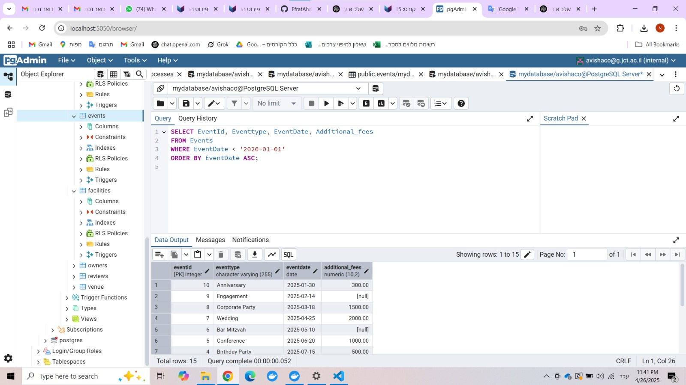

- צילום הרצה
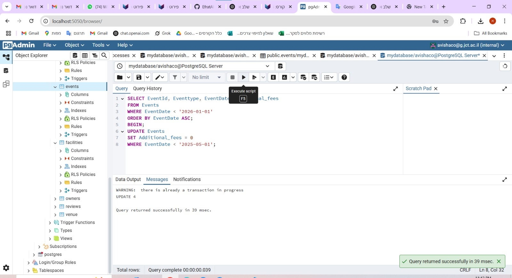

- צילום בסיס הנתונים אחרי העדכון

1. שאילתא המעדכנת את כתובת הדוא"ל של לקוח בהתבסס על ת.ז שלו
- צילום בסיס הנתונים לפני העדכון

- צילום הרצה

- צילום בסיס הנתונים אחרי העדכון

#### Constraints

1. אילוץ CHECK המוודא שהדירוג הוא בין 1 ל-5
- צילום הרצה
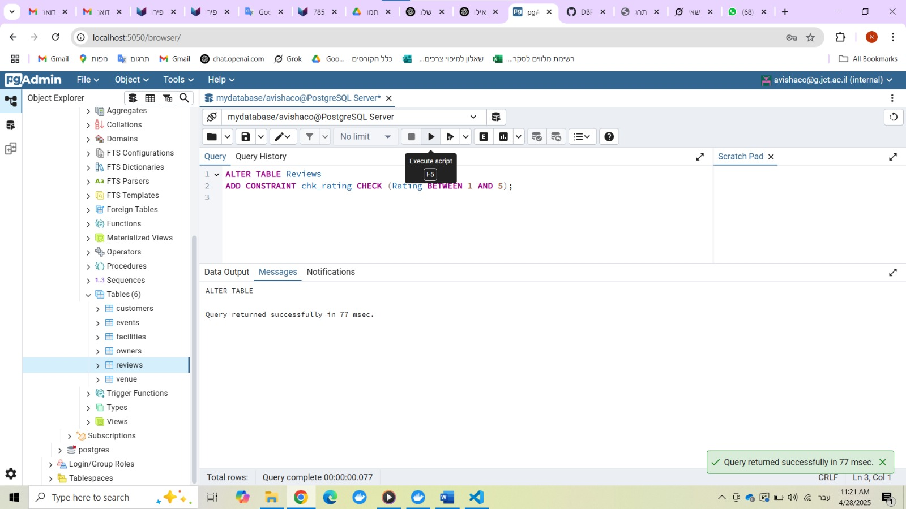

- נתונים אשר סותרים את האילוץ והודעת שגיאה
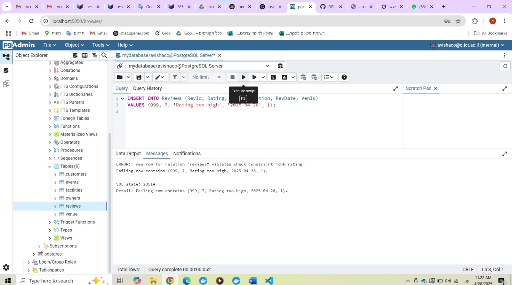

2. אילוץ NOT NULL המוודא שסוג האירוע (EventType) תמיד יסופק
- צילום הרצה
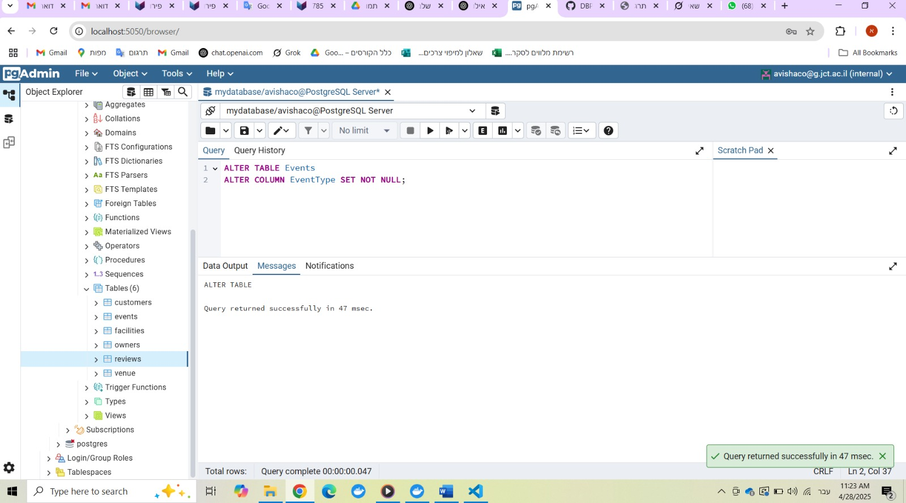

- נתונים אשר סותרים את האילוץ והודעת שגיאה
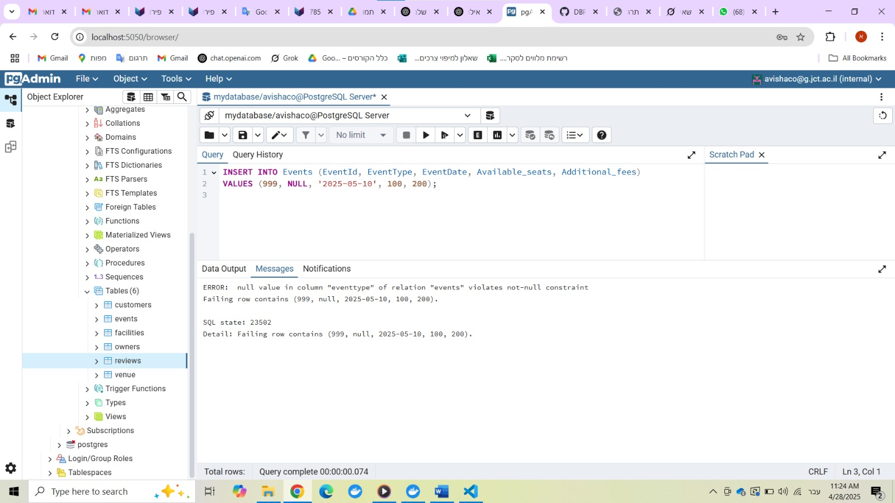

3. אילוץ CHECK כדי לוודא שתאריך האירוע אינו בעבר
- צילום הרצה

- נתונים אשר סותרים את האילוץ והודעת שגיאה
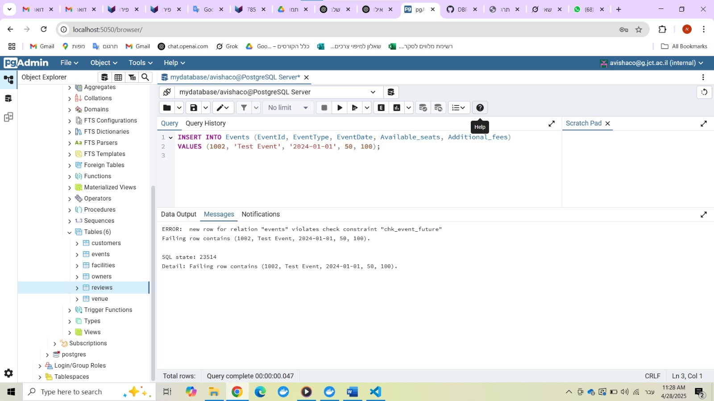

4. אילוץ DEFAULT אם לא תציין את מספר המקומות הפנויים בעת הזנת אירוע חדש, הוא יוגדר אוטומטית ל-0.

- צילום הרצה

- נתונים אשר סותרים את האילוץ (לא הכנסנו ערך ל-Available_seats!) ותוצאה המראה שהשדה Available_seats הוא 0
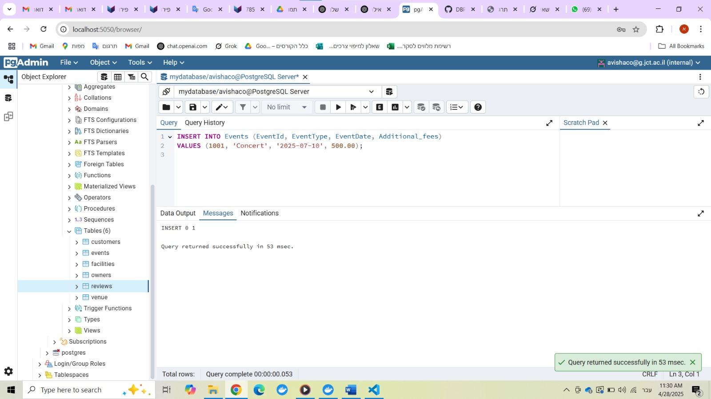
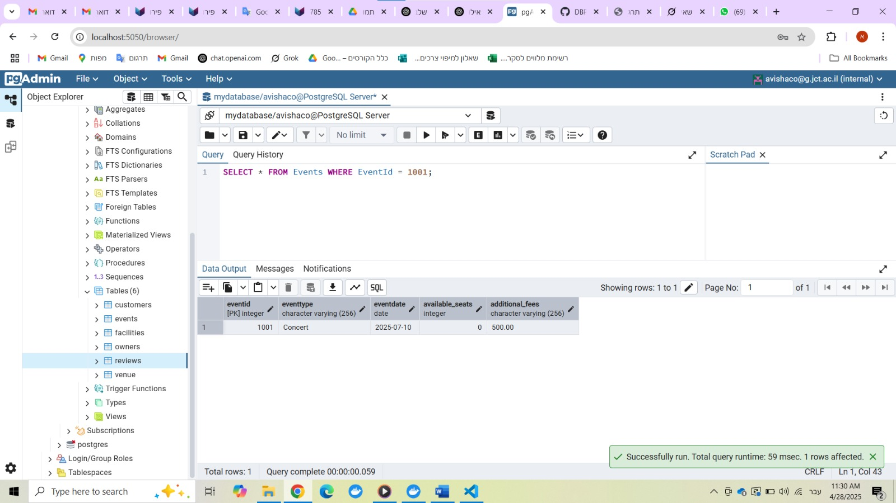

#### Rollback and Commit

COMMIT
- צילום בסיס הנתונים לפני הcommit 
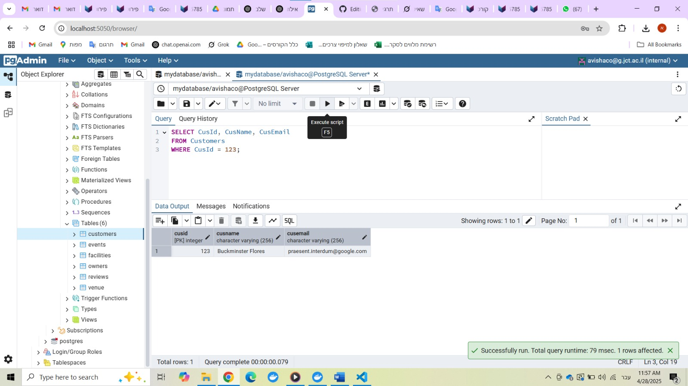

- צילום הרצה
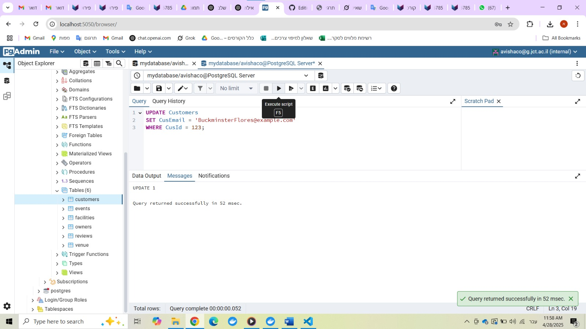
  
- צילום בסיס הנתונים אחרי הcommit 
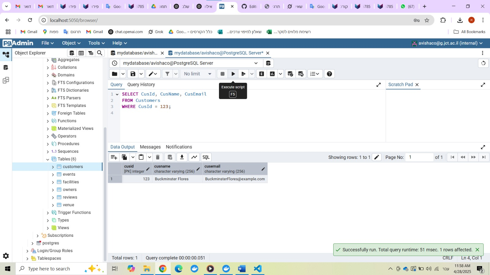

- שמירת השינויים
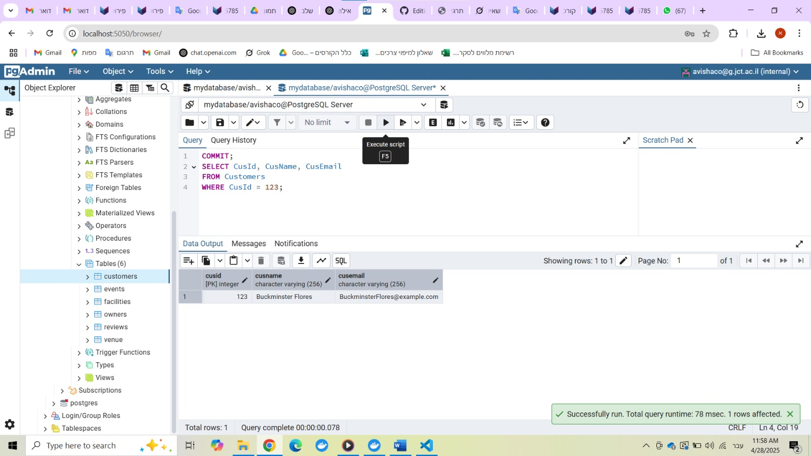

ROLLBACK
- צילום בסיס הנתונים לפני הrollback 
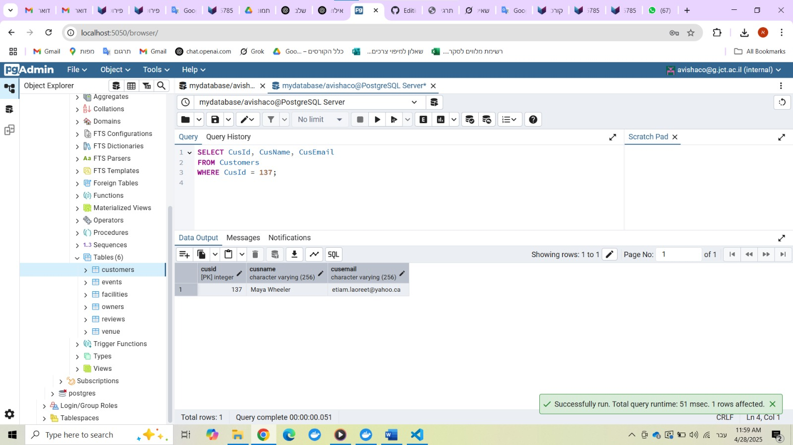

- צילום הרצה
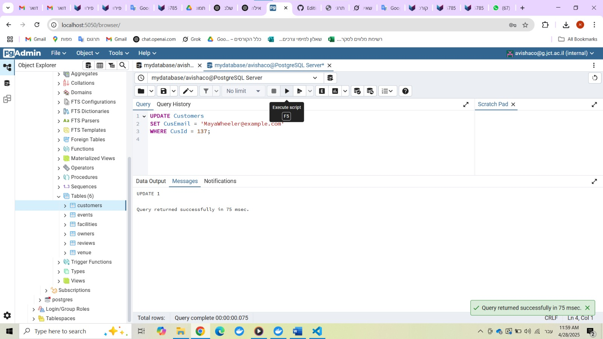
  
- צילום בסיס הנתונים אחרי הrollback 
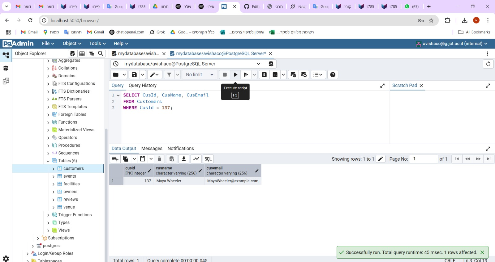

- ביטול השינוים
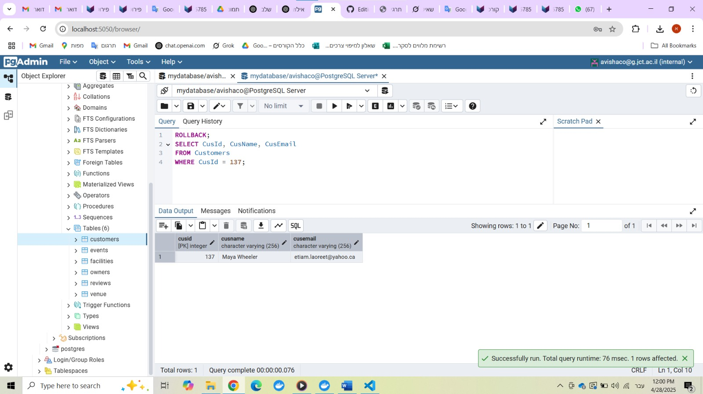

---
## Phase 3: Integration & Views

### Introduction 

In this phase, we integrated our database with another team’s system. We performed reverse engineering to recreate the other team's ERD, then designed a unified ERD combining both systems. Using ALTER commands, we adapted our existing schema without recreating tables. Finally, we created two meaningful views—one for each original system—and wrote queries to demonstrate their use.

### ERD (Entity-Relationship Diagram)  

---

### DSD (Data Structure Diagram)  

---

### Combined ERD (Entity-Relationship Diagram) 

---

### DSD after integration (Data Structure Diagram)  

---

#### The integration phase at the design level
שלב האינטגרציה ברמת העיצוב:
הסבר כללי- אנחנו יצרנו בסיס נתונים שמנהל אולמות ארועים. האגף החדש ניהל בסיס נתונים שמנהל אולמות שמקיימים בהם הופעות. שינינו את היישויות כך שיתאימו ל2 האפשרויות.
* היישות Owner נשארה ללא שינוי כיוון שזו יישות שהייתה קיימת רק אצלינו.
* היישות Facilities נשארה ללא שינוי כיוון שזו יישות שהייתה קיימת רק אצלינו.
* הReview ללא שינוי כיון שהיו לנו אותם תכונות ביישות.
* הOwner ללא שינוי כיוון שזו יישות שהייתה קיימת רק אצלינו.
* ביישות Venue הוספנו שדה חדש של parking כי זו תכונה שלא הייתה קיימת אצלינו ונכון היה כן להוסיף אותה.
* בCustomers חיברנו אותו לTicket (יישות חדשה שהוספנו) בקשר של יחיד לרבים. אצלינו היישות Customers היא הUser באגף השני.
* הPerformer היא יישות חדשה שהוספנו עם השדות:  PerformerId , PerformerName, PerfContactInfo(מפתח) והיא מחוברת לEvent בקשר של רבים לרבים. זו יישות שלא הייתה קיימת אצלינו ולשם תמיכה בהופעות הוספנו אותה.
*הקשר event_performer- טבלת קשר בין אירועים לאומנים (רבים לרבים).
* ה Sponsor היא יישות חדשה שהוספנו עם השדות: SponsorId(מפתח) ,SponsorName, Payment ומחוברת ללEvent בקשר של רבים לרבים. זו יישות שלא הייתה קיימת אצלינו ולשם תמיכה בהופעות הוספנו אותה.
* הקשר event_sponsor- טבלת קשר רבים לרבים בין נותני חסות לאירועים.
* הTicket היא יישות חדשה שהוספנו עם השדות: TicketId(מפתח) , Price , saleDate ומחוברת לEvent בקשר של יחיד לרבים וגם לCustomers בקשר של יחיד לרבים. זו יישות שלא הייתה קיימת אצלינו ולשם תמיכה בהופעות הוספנו אותה.

---
#### Use of SQL commands
שימוש בפקודות SQL:
* פקודת ALTER TABLE: לשינוי טבלאות קיימות (הוספת עמודה).
* פקודת CREATE TABLE: להגדרת טבלאות חדשות.
* פקודת FOREIGN KEY: ליצירת קשרים בין הטבלאות.
* פקודת ON DELETE CASCADE: לדאוג למחיקה אוטומטית של רשומות בתלויות.

---
#### Screenshot and description of the executed commands 
צילום מסך ותאור הפקודות שנעשו:
* הוספת השדה החדש parking

* הוספת טבלת Performer יישות חדשה עם השדות: PerformerId , PerformerName, PerfContactInfo(מפתח)

* הוספת טבלת Sponsor יישות חדשה עם השדות: SponsorId(מפתח) ,SponsorName, Payment 

* הוספת טבלת Ticket יישות חדשה עם השדות: TicketId(מפתח) , Price , saleDate

* הקשר event_performer- טבלת קשר בין אירועים לאומנים (רבים לרבים).

* הקשר event_sponsor- טבלת קשר רבים לרבים בין נותני חסות לאירועים.

---
### Views:
* מבט המציג מידע על כל כרטיס שנרכש – כולל מחיר, תאריך רכישה, שם הלקוח, וסוג האירוע.

* מבט המציג רשימה של כל האירועים עם שמות האומנים המשתתפים בהם.

---
## Phase 4: Programming

### Introduction 

In this phase, we implemented non-trivial PL/pgSQL programs based on our existing database schema. The goal was to enhance the functionality of the system through advanced database logic. Specifically, we developed two functions and two procedures that perform meaningful operations involving multiple tables. In addition, we implemented two triggers to automate behaviors in response to specific data changes. Finally, we wrote two main programs that demonstrate the practical use of the functions and procedures. These programs are designed to showcase our ability to write modular, efficient, and maintainable PL/pgSQL code.

### FUNCTION 1
פונקציה 1 ניהול אירועים וכרטיסיות
#### תיאור מילולי של הפונקציה:
הפונקציה אחראית על תהליך רכישת כרטיסים לאירוע מסוים. היא מקבלת מזהה אירוע, מזהה לקוח, מספר כרטיסים ומחיר מקסימלי מותר לכרטיס. הפונקציה מחשבת את המחיר בהתאם לסוג האירוע וגודל האולם, מיישמת הנחות לפי כמות הכרטיסים, יוצרת כרטיסים חדשים בטבלה, ומחזירה מידע על המכירה.

#### צילום הרצה:

### FUNCTION 2
פונקציה 2: יצירת דוח מפורט על אירועים עם החזרת Ref Cursor
#### תיאור מילולי של הפונקציה:
פונקציה זו יוצרת דוח מפורט על אירועים בטווח תאריכים נתון, תוך סינון לפי דירוג מינימלי. הפלט מוחזר כ־Ref Cursor, המאפשר שליפת תוצאות מרובות בצורה גמישה.

#### צילום הרצה:

### PROCEDURE 1
פרוצדורה 1: עדכון מחירי כרטיסים וניהול מבצעים
#### תיאור מילולי של הפרוצדורה:
פרוצדורה זו מבצעת עדכון דינמי של מחירי כרטיסים בהתאם לפרמטרים כגון סוג האירוע, מספר הימים שנותרו עד לתאריך האירוע, והביקוש (תפוסה). הפרוצדורה מתאימה מבצעי הנחה או העלאת מחיר, ומעדכנת את ההיסטוריה בטבלה ייעודית.

#### צילום הרצה:

### PROCEDURE 2
פרוצדורה 2: תחזוקה וניקוי נתונים במערכת
#### תיאור מילולי של הפרוצדורה:
ביצוע תחזוקה שוטפת לבסיס הנתונים באמצעות ניקוי חכם של נתונים ישנים, יתומים או לא רלוונטיים. הפרוצדורה מבצעת ניקוי מותאם לפי מצב ('SAFE' או 'AGGRESSIVE') וכוללת:
מחיקת אירועים ישנים ללא פעילות.
מחיקת כרטיסים יתומים.
מחיקת ביקורות לא איכותיות.
סימון לקוחות לא פעילים.
עדכון סטטיסטיקת אולמות.

#### צילום הרצה:

### TRIGGER 1
טריגר 1: עדכון אוטומטי של מקומות זמינים באירועים
#### תיאור מילולי של התוכנית:
ניטור בזמן אמת של שינויים בטבלת הכרטיסים (ticket) ועדכון אוטומטי של מספר המקומות הפנויים באירוע הרלוונטי בטבלת events. בנוסף, הטריגר מפעיל התראות, לוגים, וניהול חריגות.

#### צילום הרצה:

### TRIGGER 2
טריגר 2: בדיקות תקינות וביקורת לביקורות ואירועים
#### תיאור מילולי של התוכנית:
טריגר שמטרתו לוודא שביקורות (reviews) הן תקינות, אמינות ומבוססות על השתתפות באירוע, ולשמור יומן שינויים (audit trail) מלא לכל פעולה – יצירה, עדכון ומחיקה.
#### צילום הרצה:

### Main Program 1
תוכנית ראשית 1: מכירת כרטיסים ועדכון מחירים

#### תיאור מילולי של התוכנית:
תוכנית זו מנהלת תהליך מכירת כרטיסים לאירועים ועדכון מחירי הכרטיסים בהתאם לסוג האירוע ומועדו. בתחילה היא מנסה למכור כרטיסים במחיר מרבי שהוגדר, לאחר מכן מעדכנת מחירים עם הנחות ומגבלות על העלאת מחיר, ומבצעת מכירה נוספת כדי לבדוק את השפעת העדכונים. בסיום, התוכנית מפיקה דוחות סיכום וסטטיסטיקות על אירועים ומכירות נוכחיות, ומטפלת בשגיאות במהלך התהליך.

#### הקוד שלה:
-- MAIN PROGRAM 1: ticket sales + pricing update
DO $$
DECLARE
    ----------------------------------------------------------------
    -- פרמטרים ראשוניים למכירת כרטיסים
    ----------------------------------------------------------------
    v_event_id      INTEGER := 1;
    v_customer_id   INTEGER := 1;
    v_ticket_count  INTEGER := 3;
    v_max_price     NUMERIC := 200.00;

    ----------------------------------------------------------------
    -- פרמטרים לעדכון מחירים
    ----------------------------------------------------------------
    v_event_type          VARCHAR := 'Concert';
    v_discount_percentage NUMERIC := 15.0;
    v_min_days_before     INTEGER := 10;

    ----------------------------------------------------------------
    -- משתנים לסיכום
    ----------------------------------------------------------------
    v_ticket_record   RECORD;
    v_total_tickets   INTEGER := 0;
    v_total_revenue   NUMERIC := 0;
    v_success_cnt     INTEGER := 0;
    v_error_cnt       INTEGER := 0;
    v_summary_record  RECORD;
BEGIN
    RAISE NOTICE '=== MAIN PROGRAM 1: TICKET SALES AND PRICING MANAGEMENT ===';
    RAISE NOTICE 'Started at: %', CURRENT_TIMESTAMP;

    /* ------------------------------------------------------------
       PHASE 1 – ניסיון מכירת כרטיסים
    ------------------------------------------------------------ */
    RAISE NOTICE 'PHASE 1: SELLING TICKETS';
    RAISE NOTICE 'Attempting to sell % tickets for event % to customer %',
                 v_ticket_count, v_event_id, v_customer_id;

    BEGIN
        FOR v_ticket_record IN
            SELECT * FROM manage_ticket_sales(
                v_event_id,
                v_customer_id,
                v_ticket_count,
                v_max_price)
        LOOP
            IF v_ticket_record.sale_status = 'SOLD' THEN
                v_success_cnt   := v_success_cnt + 1;
                v_total_revenue := v_total_revenue + v_ticket_record.final_price;

                RAISE NOTICE
                      'SUCCESS: Ticket ID % sold for $%  (seats remaining: %)',
                      v_ticket_record.ticket_id,
                      v_ticket_record.final_price,
                      v_ticket_record.seats_remaining;
            ELSE
                v_error_cnt := v_error_cnt + 1;
                RAISE NOTICE 'FAILED: %', v_ticket_record.sale_status;
            END IF;
        END LOOP;

        v_total_tickets := v_success_cnt;

    EXCEPTION
        WHEN OTHERS THEN
            RAISE NOTICE 'ERROR in ticket sales: %', SQLERRM;
            v_error_cnt := v_error_cnt + 1;
    END;

    RAISE NOTICE '';
    RAISE NOTICE 'PHASE 1 RESULTS – sold:%  failed:%  revenue:$%',
                 v_success_cnt,
                 v_error_cnt,
                 ROUND(v_total_revenue,2);

    /* ------------------------------------------------------------
       PHASE 2 – עדכון מחירים
    ------------------------------------------------------------ */
    RAISE NOTICE '';
    RAISE NOTICE 'PHASE 2: UPDATING TICKET PRICING';
    RAISE NOTICE 'Event type: %  |  Discount: % %%  |  Min‑days: %',
                 v_event_type,
                 v_discount_percentage,
                 v_min_days_before;

    BEGIN
        CALL update_ticket_pricing_and_promotions(
            v_event_type,
            v_discount_percentage,
            v_min_days_before,
            50.00   -- max price increase
        );
        RAISE NOTICE 'Pricing update completed successfully';
    EXCEPTION
        WHEN OTHERS THEN
            RAISE NOTICE 'ERROR in pricing update: %', SQLERRM;
    END;

    /* ------------------------------------------------------------
       PHASE 3 – מכירה נוספת אחרי שינוי מחירים
    ------------------------------------------------------------ */
    RAISE NOTICE '';
    RAISE NOTICE 'PHASE 3: SELLING ADDITIONAL TICKETS AFTER PRICING UPDATE';

    v_event_id     := 2;
    v_customer_id  := 2;
    v_ticket_count := 2;
    v_success_cnt  := 0;
    v_error_cnt    := 0;

    BEGIN
        FOR v_ticket_record IN
            SELECT * FROM manage_ticket_sales(
                v_event_id,
                v_customer_id,
                v_ticket_count,
                v_max_price)
        LOOP
            IF v_ticket_record.sale_status = 'SOLD' THEN
                v_success_cnt   := v_success_cnt + 1;
                v_total_revenue := v_total_revenue + v_ticket_record.final_price;

                RAISE NOTICE
                      'SUCCESS: Ticket ID % sold for $%',
                      v_ticket_record.ticket_id,
                      v_ticket_record.final_price;
            ELSE
                v_error_cnt := v_error_cnt + 1;
                RAISE NOTICE 'FAILED: %', v_ticket_record.sale_status;
            END IF;
        END LOOP;

        v_total_tickets := v_total_tickets + v_success_cnt;

    EXCEPTION
        WHEN OTHERS THEN
            RAISE NOTICE 'ERROR in additional ticket sales: %', SQLERRM;
    END;

    /* ------------------------------------------------------------
       PHASE 4 – דוח סיכום
    ------------------------------------------------------------ */
    RAISE NOTICE '';
    RAISE NOTICE 'PHASE 4: SUMMARY REPORT';

    -- סטטיסטיקה על אירועים עתידיים
    FOR v_summary_record IN
        SELECT COUNT(*)  AS total_events,
               SUM(CASE WHEN available_seats = 0 THEN 1 ELSE 0 END) AS sold_out,
               AVG(available_seats) AS avg_avail
        FROM   events
        WHERE  eventdate >= CURRENT_DATE
    LOOP
        RAISE NOTICE 'Upcoming events: % | Sold‑out: % | Avg seats left: %',
                     v_summary_record.total_events,
                     v_summary_record.sold_out,
                     COALESCE(ROUND(v_summary_record.avg_avail),0);
    END LOOP;

    -- סטטיסטיקה של מכירות היום
    FOR v_summary_record IN
        SELECT COUNT(*) AS tickets_today,
               SUM(price) AS revenue_today,
               AVG(price) AS avg_price_today
        FROM   ticket
        WHERE  saledate = CURRENT_DATE
    LOOP
        RAISE NOTICE 'Today – tickets:%  revenue:$%  avg price:$%',
                     v_summary_record.tickets_today,
                     COALESCE(ROUND(v_summary_record.revenue_today,2),0),
                     COALESCE(ROUND(v_summary_record.avg_price_today,2),0);
    END LOOP;

    /* ------------------------------------------------------------
       סיכום כולל
    ------------------------------------------------------------ */
    RAISE NOTICE '';
    RAISE NOTICE '=== PROGRAM EXECUTION SUMMARY ===';
    RAISE NOTICE 'Total tickets sold: %', v_total_tickets;
    RAISE NOTICE 'Total revenue:      $%', ROUND(v_total_revenue,2);
    RAISE NOTICE 'Completed at: %',    CURRENT_TIMESTAMP;

    COMMIT;

EXCEPTION
    WHEN OTHERS THEN
        RAISE NOTICE 'CRITICAL ERROR in main program: %', SQLERRM;
        ROLLBACK;
END;
$$;

#### הוכחה שהתוכנית אכן עובדת:

### Main Program 2
תוכנית ראשית 2: עדכון כמות מקומות ופרס לספונסרים
#### תיאור מילולי של התוכנית:
התוכנית מפיקה דוח מפורט על האירועים, מבצעת עדכוני מחירים חכמים לפי מצב התפוסה, מבצעת תחזוקה וניקוי של אירועים ישנים במידת הצורך, ומסכמת את כל התהליך עם דוחות, המלצות ומעקב שגיאות.

#### הקוד שלה:
-- תוכנית ראשית - מערכת ניהול אירועים משולבת (גרסה מתוקנת)
-- משלבת דוח אירועים + עדכון מחירים + ניקוי מערכת

DO $$
DECLARE
    -- משתנים עיקריים
    v_report_cursor REFCURSOR;
    v_event_record RECORD;
    v_processed_events INTEGER := 0;
    v_high_revenue_events INTEGER := 0;
    v_low_occupancy_events INTEGER := 0;
    
    -- פרמטרים לדוח
    v_start_date DATE := CURRENT_DATE - INTERVAL '60 days';
    v_end_date DATE := CURRENT_DATE + INTERVAL '30 days';
    v_min_rating INTEGER := 3;
    
    -- פרמטרים לעדכון מחירים
    v_concert_discount NUMERIC := 15.0;
    v_theater_discount NUMERIC := 10.0;
    v_days_threshold INTEGER := 14;
    
    -- משתנים סטטיסטיים
    v_total_revenue NUMERIC := 0;
    v_avg_occupancy NUMERIC := 0;
    v_events_needing_promotion INTEGER := 0;
    
    -- Exception handling
    v_error_count INTEGER := 0;
    v_current_operation VARCHAR(100);
    
BEGIN
    RAISE NOTICE '=== התחלת תוכנית ניהול אירועים משולבת ===';
    RAISE NOTICE 'תאריך התחלה: %', v_start_date;
    RAISE NOTICE 'תאריך סיום: %', v_end_date;
    RAISE NOTICE 'דירוג מינימלי: %', v_min_rating;
    
    -- שלב 1: יצירת דוח מפורט על אירועים
    BEGIN
        v_current_operation := 'Creating events report';
        RAISE NOTICE '';
        RAISE NOTICE '--- שלב 1: יצירת דוח אירועים ---';
        
        -- קריאה לפונקציה get_events_report
        SELECT get_events_report(v_start_date, v_end_date, v_min_rating) 
        INTO v_report_cursor;
        
        -- עיבוד תוצאות הדוח
        LOOP
            FETCH v_report_cursor INTO v_event_record;
            EXIT WHEN NOT FOUND;
            
            v_processed_events := v_processed_events + 1;
            v_total_revenue := v_total_revenue + COALESCE(v_event_record.event_revenue, 0);
            
            -- זיהוי אירועים בעלי הכנסות גבוהות
            IF v_event_record.event_revenue > 5000 THEN
                v_high_revenue_events := v_high_revenue_events + 1;
                RAISE NOTICE 'אירוע רווחי: % - סוג: % - הכנסות: $%', 
                           v_event_record.eventid, 
                           v_event_record.eventtype,
                           v_event_record.event_revenue;
            END IF;
            
            -- זיהוי אירועים עם תפוסה נמוכה הזקוקים לקידום
            IF v_event_record.occupancy_rate < 50 
               AND v_event_record.eventdate > CURRENT_DATE THEN
                v_low_occupancy_events := v_low_occupancy_events + 1;
                v_events_needing_promotion := v_events_needing_promotion + 1;
                
                RAISE NOTICE 'אירוע זקוק לקידום: % - תפוסה: %', 
                           v_event_record.eventid,
                           ROUND(v_event_record.occupancy_rate, 1);
                RAISE NOTICE '  מקומות זמינים: %', v_event_record.available_seats;
            END IF;
            
            -- חישוב ממוצע תפוסה
            v_avg_occupancy := v_avg_occupancy + COALESCE(v_event_record.occupancy_rate, 0);
            
            -- הדפסת פרטי אירוע מעניינים (רק לאירועים הראשונים)
            IF v_processed_events <= 3 THEN
                RAISE NOTICE 'אירוע %: % ב-%', 
                           v_event_record.eventid,
                           v_event_record.eventtype,
                           v_event_record.venname;
                RAISE NOTICE '  תאריך: % - תפוסה: %', 
                           v_event_record.eventdate,
                           ROUND(v_event_record.occupancy_rate, 1);
                RAISE NOTICE '  ביקורות: % - דירוג ממוצע: %', 
                           v_event_record.total_reviews,
                           ROUND(v_event_record.average_rating, 2);
            END IF;
        END LOOP;
        
        CLOSE v_report_cursor;
        
        -- חישוב סטטיסטיקות
        IF v_processed_events > 0 THEN
            v_avg_occupancy := v_avg_occupancy / v_processed_events;
        END IF;
        
        RAISE NOTICE 'סיכום דוח: % אירועים נמצאו', v_processed_events;
        RAISE NOTICE 'סה"כ הכנסות: $%', ROUND(v_total_revenue, 2);
        RAISE NOTICE 'ממוצע תפוסה: %', ROUND(v_avg_occupancy, 2);
                     
    EXCEPTION
        WHEN OTHERS THEN
            v_error_count := v_error_count + 1;
            RAISE NOTICE 'שגיאה בשלב %: %', v_current_operation, SQLERRM;
    END;
    
    -- שלב 2: עדכון מחירי כרטיסים לאירועים זקוקים לקידום
    BEGIN
        v_current_operation := 'Updating ticket pricing';
        RAISE NOTICE '';
        RAISE NOTICE '--- שלב 2: עדכון מחירי כרטיסים ---';
        
        IF v_events_needing_promotion > 0 THEN
            RAISE NOTICE 'מעדכן מחירים עבור אירועי קונצרטים';
            RAISE NOTICE 'הנחה: %', v_concert_discount;
            
            -- עדכון מחירים לקונצרטים
            CALL update_ticket_pricing_and_promotions(
                p_event_type := 'Concert',
                p_discount_percentage := v_concert_discount,
                p_min_days_before_event := v_days_threshold,
                p_max_price_increase := 30.0
            );
            
            RAISE NOTICE 'מעדכן מחירים עבור אירועי תיאטרון';
            RAISE NOTICE 'הנחה: %', v_theater_discount;
            
            -- עדכון מחירים לתיאטרון
            CALL update_ticket_pricing_and_promotions(
                p_event_type := 'Theater',
                p_discount_percentage := v_theater_discount,
                p_min_days_before_event := v_days_threshold,
                p_max_price_increase := 25.0
            );
        ELSE
            RAISE NOTICE 'לא נמצאו אירועים הזקוקים לעדכון מחירים';
        END IF;
        
    EXCEPTION
        WHEN OTHERS THEN
            v_error_count := v_error_count + 1;
            RAISE NOTICE 'שגיאה בשלב %: %', v_current_operation, SQLERRM;
    END;
    
    -- שלב 3: ניקוי מערכת אם יש הרבה אירועים ישנים
    BEGIN
        v_current_operation := 'System maintenance cleanup';
        RAISE NOTICE '';
        RAISE NOTICE '--- שלב 3: בדיקת צורך בניקוי מערכת ---';
        
        DECLARE
            v_old_events_count INTEGER;
        BEGIN
            -- בדיקת כמות אירועים ישנים
            SELECT COUNT(*)
            INTO v_old_events_count
            FROM events
            WHERE eventdate < CURRENT_DATE - INTERVAL '180 days';
            
            RAISE NOTICE 'נמצאו % אירועים ישנים (מעל 180 יום)', v_old_events_count;
            
            IF v_old_events_count > 100 THEN
                RAISE NOTICE 'מפעיל ניקוי מערכת במצב AGGRESSIVE';
                
                CALL system_maintenance_cleanup(
                    p_days_old := 365,
                    p_cleanup_mode := 'AGGRESSIVE'
                );
            ELSIF v_old_events_count > 50 THEN
                RAISE NOTICE 'מפעיל ניקוי מערכת במצב SAFE';
                
                CALL system_maintenance_cleanup(
                    p_days_old := 180,
                    p_cleanup_mode := 'SAFE'
                );
            ELSE
                RAISE NOTICE 'לא נדרש ניקוי מערכת כרגע';
            END IF;
        END;
        
    EXCEPTION
        WHEN OTHERS THEN
            v_error_count := v_error_count + 1;
            RAISE NOTICE 'שגיאה בשלב %: %', v_current_operation, SQLERRM;
    END;
    
    -- שלב 4: סיכום ודיווח
    BEGIN
        v_current_operation := 'Final summary';
        RAISE NOTICE '';
        RAISE NOTICE '=== סיכום תוכנית ניהול אירועים ===';
        RAISE NOTICE 'אירועים שעובדו: %', v_processed_events;
        RAISE NOTICE 'אירועים רווחיים: %', v_high_revenue_events;
        RAISE NOTICE 'אירועים עם תפוסה נמוכה: %', v_low_occupancy_events;
        RAISE NOTICE 'סה"כ הכנסות: $%', ROUND(v_total_revenue, 2);
        RAISE NOTICE 'ממוצע תפוסה: %', ROUND(v_avg_occupancy, 2);
        RAISE NOTICE 'שגיאות שאירעו: %', v_error_count;
        
        -- המלצות בהתבסס על הנתונים
        RAISE NOTICE '';
        RAISE NOTICE '--- המלצות ---';
        
        IF v_avg_occupancy < 60 THEN
            RAISE NOTICE '• ממוצע התפוסה נמוך - מומלץ לשפר אסטרטגיות שיווק';
        END IF;
        
        IF v_low_occupancy_events > (v_processed_events * 0.3) THEN
            RAISE NOTICE '• יותר מ-30 אחוז מהאירועים עם תפוסה נמוכה';
            RAISE NOTICE '  מומלץ לבחון מחירים והיצע';
        END IF;
        
        IF v_high_revenue_events > 0 THEN
            RAISE NOTICE '• יש % אירועים רווחיים', v_high_revenue_events;
            RAISE NOTICE '  מומלץ לנתח מה הופך אותם למוצלחים';
        END IF;
        
        IF v_error_count = 0 THEN
            RAISE NOTICE '✓ התוכנית הושלמה בהצלחה ללא שגיאות!';
        ELSE
            RAISE NOTICE '⚠ התוכנית הושלמה עם % שגיאות', v_error_count;
            RAISE NOTICE '  יש לבדוק הלוגים';
        END IF;
        
    EXCEPTION
        WHEN OTHERS THEN
            RAISE NOTICE 'שגיאה חמורה בסיכום: %', SQLERRM;
    END;
    
    RAISE NOTICE '=== סיום תוכנית ניהול אירועים ===';
    
EXCEPTION
    WHEN OTHERS THEN
        RAISE NOTICE 'שגיאה כללית בתוכנית: %', SQLERRM;
        RAISE;
END;
$$;

#### הוכחה שהתוכנית אכן עובדת:

---

## Phase 5 – Creating a Graphical User Interface (GUI) for Working with the Database

### Introduction  
Event and Venue Management System with Ticketing and Response Handling

Full-stack development using React.js with TypeScript (Frontend) and Node.js with Express (Backend)

Database managed via PostgreSQL on pgAdmin in Docker

Custom UI components, including dynamic tables for data presentation

Integrated RESTful APIs for seamless communication between frontend and database

Key skills: database design and management, interactive UI development, state management in React, TypeScript for improved code quality, responsive design

Features include event and venue management, customer management system, modular admin dashboard with category filters, and dynamic data analytics

מערכת לניהול אולמות ואירועים עם כרטיסים וטיפול בתגובות

פיתוח מלא (Full-stack) עם React.js ו-TypeScript בצד הלקוח ו־Node.js עם Express בצד השרת

מסד נתונים PostgreSQL מנוהל באמצעות pgAdmin בתוך Docker

שימוש ברכיבי UI מותאמים אישית, כולל טבלאות דינמיות להצגת נתונים

אינטגרציה עם RESTful APIs לתקשורת יעילה בין ה-Frontend ל-Database

כישורים מרכזיים: עיצוב וניהול מסדי נתונים, פיתוח ממשקי משתמש אינטראקטיביים, ניהול State בריאקט, שימוש ב-TypeScript לשיפור איכות הקוד, ועיצוב רספונסיבי

פונקציות מרכזיות: ניהול אירועים ואולמות, מערכת ניהול לקוחות, דשבורד מודולרי עם סינון לפי קטגוריות, וניתוח דינמי של נתונים.

### Project Execution Guide
Steps to run the project:
1. Restore the attached backup.
2. Install the packages:
npm install next react react-dom
npm install
You might need to install additional packages as well.
5. Run the project:
npm run dev

שלבים להרצה:
1. לעשות RESTORE לBACKUP המצורף
2. להתקין את החבילות
npm install next react react-dom
npm install
יתכן ותצטרכו להתקין חבילות נוספות.
4. להריץ npm run dev

