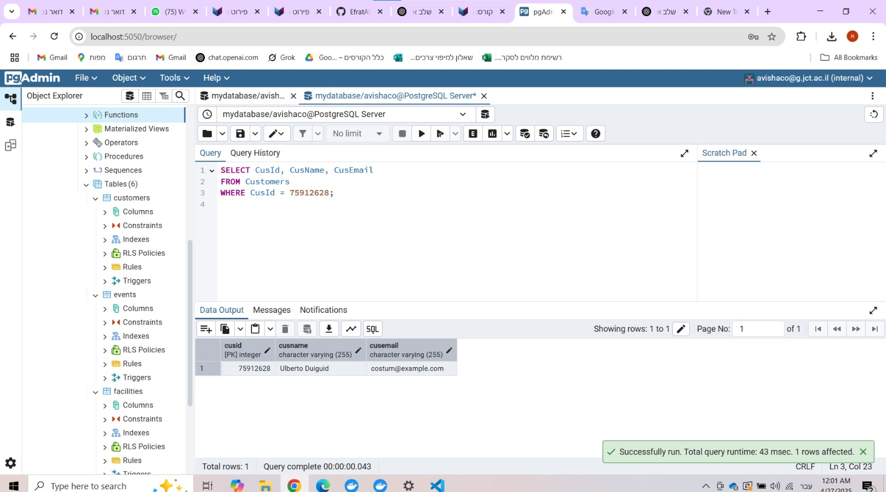

# Avishag Timstit & Efrat Aharoni 

## Table of Contents  
- [Phase 1: Design and Build the Database](#phase-1-design-and-build-the-database)  
  - [Introduction](#introduction)  
  - [ERD (Entity-Relationship Diagram)](#erd-entity-relationship-diagram)  
  - [DSD (Data Structure Diagram)](#dsd-data-structure-diagram)  
  - [SQL Scripts](#sql-scripts)  
  - [Data](#data)  
- [Phase 2: Queries & Constraints](#phase-2-integration)  
  - [Introduction](#introduction)  
  - [SQL Queries](#SQL-Queries)  
  - [SELECT Queries](#SELECT-Queries)
  - [DELETE Queries](#DELETE-Queries)  
  - [UPDATE Queries](#UPDATE-Queries)  
  - [Constraints](#Constraints)

---

## Phase 1: Design and Build the Database  

### Introduction  

The **Nursery School Database** is designed to efficiently manage information related to children, parents, nannies, and nursery groups. This system ensures smooth organization and tracking of essential details such as group assignments, caregiver experience, child-parent relationships, and contact information.  

---

### ERD (Entity-Relationship Diagram)  

---

### DSD (Data Structure Diagram)  

---

### SQL Scripts  

Provide the following SQL scripts:  

- **Create Tables Script** - The SQL script for creating the database tables is available in the repository:  
 📜 **[View `CreateTables.sql`](https://github.com/EfratAharoni/DBProject5785/blob/main/Phase1/scripts/CreateTables.sql)**  

- **Insert Data Script** - The SQL script for insert data to the database tables is available in the repository:  
 📜 **[View `InsertTable.sql`](https://github.com/EfratAharoni/DBProject5785/blob/main/Phase1/scripts/InsertTable.sql)**  

- **Drop Tables Script** - The SQL script for dropping all tables is available in the repository:  
 📜 **[View `DropTable.sql`](https://github.com/EfratAharoni/DBProject5785/blob/main/Phase1/scripts/DropTable.sql)**  

- **Select All Data Script** - The SQL script for selecting all tables is available in the repository:  
 📜 **[View `SelectTable.sql`](https://github.com/EfratAharoni/DBProject5785/blob/main/Phase1/scripts/SelectTable.sql)**  

---

### Data  

#### First tool: using [mockaroo](https://www.mockaroo.com/) to create CSV files  

##### Entering data to **Facilities** table  
- Facilities ID scope: 1-400  
 📜 **[View `Facilities.csv`](https://github.com/EfratAharoni/DBProject5785/blob/main/Phase1/mockData/Facilities.csv)**  

##### Entering data to **Reviews** table  
- Reviews ID scope: 1-400  
 📜 **[View `Reviews.csv`](https://github.com/EfratAharoni/DBProject5785/blob/main/Phase1/mockData/Reviews.csv)**  

##### Entering data to **Venue** table  
- Venue ID scope: 1-400  
 📜 **[View `Venue.csv`](https://github.com/EfratAharoni/DBProject5785/blob/main/Phase1/mockData/Venue.csv)**  

##### Entering data to **Apotropus** table  
- Person ID scope: 401-800  
- Formula of Venue ID: `this + 1`  

---

#### Second tool: using [generatedata](https://generatedata.com/generator) to create CSV files  

##### Entering data to **Customers** table  
- Group Number scope: 1-400  

📜[Customers](https://github.com/EfratAharoni/DBProject5785/blob/main/Phase1/generateData/Customers.csv)

**Results for the command:**  
SELECT COUNT(*) FROM Customers;

**Third tool: using python to create csv file**

### Backup
**backups files are kept with the date and hour of the backup:**

---
## Phase 2: Queries & Constraints

### Introduction  

In this phase, we focused on querying and manipulating the database in more advanced ways. The goal was to demonstrate complex SQL capabilities such as multi-table queries, conditional logic, transaction management, and data integrity through constraints.

---
### SQL Queries

#### SELECT Queries
1. **השאילתא מחזירה את הלקוחות שהשתתפו באירועים עם יותר מ־1000 מקומות פנויים**

2. **השאילתא מחזירה בעלים של מקומות עם מחיר השכרה מעל 30,000**

3. **מאחזר ביקורות על מקומות שבהם התרחשו אירועים במהלך ינואר 2025, כולל פרטי סקירה, תאריך האירוע ופרטי המקום**

4. **השאילתא מחזירה את שם המקום, השנה, החודש ומספר האירועים**

5. **השאילתא מחזירה ממוצע דירוג לכל אולם**

6. **השאילתא מציגה את כל האירועים שהתקיימו בשנת 2025 באולמות שבהם מחיר השכירות גבוה מהממוצע, ממוין לפי מספר המקומות הפנויים (מהכי הרבה לפחות).**

7. **מחזירה אולמות שלא קיבלו חוות דעת עם דירוג 4 ומעלה.**

8. **השאילתא מחזירה אולמות שאין להם מתקנים משויכים**

#### DELETE Queries

1. השאילתא מוחקת אולמות שאין להם דירוגים
- צילום בסיס הנתונים לפני העדכון

- צילום הרצה

  
- צילום בסיס הנתונים אחרי העדכון

2. שאילתא המוחקת ביקורות עם דירוג נמוך מאוד (1 מתוך 5)
- צילום בסיס הנתונים לפני העדכון

- צילום הרצה

- צילום בסיס הנתונים אחרי העדכון

3. שאילתא המוחקת בעלי אולמות (Owners) שהאולם שלהם אין עליו בכלל ביקורות (Reviews) או אין עליו הזמנות
- צילום בסיס הנתונים לפני העדכון

- צילום הרצה

- צילום בסיס הנתונים אחרי העדכון

  
#### UPDATE Queries

1. שאילתא המעדכנת את מחיר השכירות עבור מקומות שקיבלו ביקורת של 5 כוכבים 
- צילום בסיס הנתונים לפני העדכון

- צילום הרצה

- צילום בסיס הנתונים אחרי העדכון

  
1. שאילתא המעדכנת את התשלומים הנוספים (Additional_fees) ל-0 עבור אירועים שהתרחשו לפני מאי 2025
- צילום בסיס הנתונים לפני העדכון

- צילום הרצה

- צילום בסיס הנתונים אחרי העדכון

1. שאילתא המעדכנת את כתובת הדוא"ל של לקוח בהתבסס על ת.ז שלו
- צילום בסיס הנתונים לפני העדכון

- צילום הרצה

- צילום בסיס הנתונים אחרי העדכון

