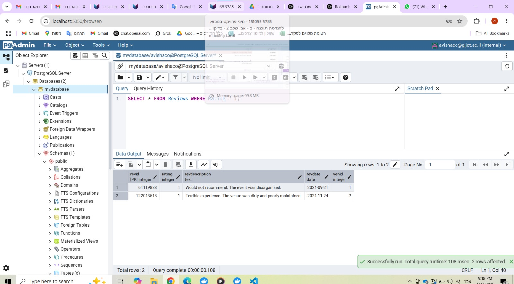

# Avishag Timstit & Efrat Aharoni 

## Table of Contents  
- [Phase 1: Design and Build the Database](#phase-1-design-and-build-the-database)  
  - [Introduction](#introduction)  
  - [ERD (Entity-Relationship Diagram)](#erd-entity-relationship-diagram)  
  - [DSD (Data Structure Diagram)](#dsd-data-structure-diagram)  
  - [SQL Scripts](#sql-scripts)  
  - [Data](#data)  
- [Phase 2: Queries & Constraints](#phase-2-integration)  
  - [Introduction](#introduction)  
  - [SQL Queries](#SQL-Queries)  
  - [SELECT Queries](#SELECT-Queries)
  - [DELETE Queries](#DELETE-Queries)  
  - [UPDATE Queries](#UPDATE-Queries)  
  - [Constraints](#Constraints)
  - [Rollback and Commit](#Rollback_And_Commit)

---

## Phase 1: Design and Build the Database  

### Introduction  

The **Nursery School Database** is designed to efficiently manage information related to children, parents, nannies, and nursery groups. This system ensures smooth organization and tracking of essential details such as group assignments, caregiver experience, child-parent relationships, and contact information.  

---

### ERD (Entity-Relationship Diagram)  

---

### DSD (Data Structure Diagram)  

---

### SQL Scripts  

Provide the following SQL scripts:  

- **Create Tables Script** - The SQL script for creating the database tables is available in the repository:  
📜 **[View `CreateTables.sql`](https://github.com/EfratAharoni/DBProject5785/blob/main/Phase1/scripts/CreateTables.sql)**  

- **Insert Data Script** - The SQL script for insert data to the database tables is available in the repository:  
📜 **[View `InsertTable.sql`](https://github.com/EfratAharoni/DBProject5785/blob/main/Phase1/scripts/InsertTable.sql)**  

- **Drop Tables Script** - The SQL script for dropping all tables is available in the repository:  
📜 **[View `DropTable.sql`](https://github.com/EfratAharoni/DBProject5785/blob/main/Phase1/scripts/DropTable.sql)**  

- **Select All Data Script** - The SQL script for selecting all tables is available in the repository:  
📜 **[View `SelectTable.sql`](https://github.com/EfratAharoni/DBProject5785/blob/main/Phase1/scripts/SelectTable.sql)**  

---

### Data  

#### First tool: using [mockaroo](https://www.mockaroo.com/) to create CSV files  

##### Entering data to **Facilities** table  
- Facilities ID scope: 1-400  
📜 **[View `Facilities.csv`](https://github.com/EfratAharoni/DBProject5785/blob/main/Phase1/mockData/Facilities.csv)**  

##### Entering data to **Reviews** table  
- Reviews ID scope: 1-400  
📜 **[View `Reviews.csv`](https://github.com/EfratAharoni/DBProject5785/blob/main/Phase1/mockData/Reviews.csv)**  

##### Entering data to **Venue** table  
- Venue ID scope: 1-400  
📜 **[View `Venue.csv`](https://github.com/EfratAharoni/DBProject5785/blob/main/Phase1/mockData/Venue.csv)**  

##### Entering data to **Apotropus** table  
- Person ID scope: 401-800  
- Formula of Venue ID: `this + 1`  

---

#### Second tool: using [generatedata](https://generatedata.com/generator) to create CSV files  

##### Entering data to **Customers** table  
- Group Number scope: 1-400  

📜[Customers](https://github.com/EfratAharoni/DBProject5785/blob/main/Phase1/generateData/Customers.csv)

**Results for the command:**  
SELECT COUNT(*) FROM Customers;

**Third tool: using python to create csv file**

### Backup
**backups files are kept with the date and hour of the backup:**

---
## Phase 2: Queries & Constraints

### Introduction  

In this phase, we focused on querying and manipulating the database in more advanced ways. The goal was to demonstrate complex SQL capabilities such as multi-table queries, conditional logic, transaction management, and data integrity through constraints.

---
### SQL Queries

#### SELECT Queries
1. **השאילתא מחזירה את הלקוחות שהשתתפו באירועים עם יותר מ־1000 מקומות פנויים**

2. **השאילתא מחזירה בעלים של מקומות עם מחיר השכרה מעל 30,000**

3. **מאחזר ביקורות על מקומות שבהם התרחשו אירועים במהלך ינואר 2025, כולל פרטי סקירה, תאריך האירוע ופרטי המקום**

4. **השאילתא מחזירה את שם המקום, השנה, החודש ומספר האירועים**

5. **ממוצע וכמות דירוגים לכל קיבולת אולם.**

6. **השאילתא מציגה את כל האירועים שהתקיימו בשנת 2025 באולמות שבהם מחיר השכירות גבוה מהממוצע, ממוין לפי מספר המקומות הפנויים (מהכי הרבה לפחות).**

7. **מחזירה אולמות שלא קיבלו חוות דעת עם דירוג 4 ומעלה.**

8. **מקומות עם הדירוג הממוצע שלהם, זמינות המתקנים ומידע בסיסי על המקום**

#### DELETE Queries

1. השאילתא מוחקת אולמות שאין להם דירוגים
- צילום בסיס הנתונים לפני העדכון

- צילום הרצה

  
- צילום בסיס הנתונים אחרי העדכון

2. שאילתא המוחקת ביקורות עם דירוג נמוך מאוד (1 מתוך 5)
- צילום בסיס הנתונים לפני העדכון

- צילום הרצה

- צילום בסיס הנתונים אחרי העדכון

3. שאילתא המוחקת בעלי אולמות (Owners) שהאולם שלהם אין עליו בכלל ביקורות (Reviews) או אין עליו הזמנות
- צילום בסיס הנתונים לפני העדכון

- צילום הרצה

- צילום בסיס הנתונים אחרי העדכון

  
#### UPDATE Queries

1. שאילתא המעדכנת את מחיר השכירות עבור מקומות שקיבלו ביקורת של 5 כוכבים
- צילום בסיס הנתונים לפני העדכון

- צילום הרצה

- צילום בסיס הנתונים אחרי העדכון

  
1. שאילתא המעדכנת את התשלומים הנוספים (Additional_fees) ל-0 עבור אירועים שהתרחשו לפני מאי 2025
- צילום בסיס הנתונים לפני העדכון

- צילום הרצה

- צילום בסיס הנתונים אחרי העדכון

1. שאילתא המעדכנת את כתובת הדוא"ל של לקוח בהתבסס על ת.ז שלו
- צילום בסיס הנתונים לפני העדכון

- צילום הרצה

- צילום בסיס הנתונים אחרי העדכון

#### Constraints

1. אילוץ CHECK המוודא שהדירוג הוא בין 1 ל-5
- צילום הרצה

- נתונים אשר סותרים את האילוץ והודעת שגיאה

2. אילוץ NOT NULL המוודא שסוג האירוע (EventType) תמיד יסופק
- צילום הרצה

- נתונים אשר סותרים את האילוץ והודעת שגיאה

3. אילוץ CHECK כדי לוודא שתאריך האירוע אינו בעבר
- צילום הרצה

- נתונים אשר סותרים את האילוץ והודעת שגיאה

4. אילוץ DEFAULT אם לא תציין את מספר המקומות הפנויים בעת הזנת אירוע חדש, הוא יוגדר אוטומטית ל-0.

- צילום הרצה

- נתונים אשר סותרים את האילוץ (לא הכנסנו ערך ל-Available_seats!) ותוצאה המראה שהשדה Available_seats הוא 0

#### Rollback and Commit

COMMIT
- צילום בסיס הנתונים לפני הcommit 

- צילום הרצה

  
- צילום בסיס הנתונים אחרי הcommit 

- שמירת השינויים

ROLLBACK
- צילום בסיס הנתונים לפני הrollback 

- צילום הרצה

  
- צילום בסיס הנתונים אחרי הrollback 

- ביטול השינוים

---
## Phase 3: Integration & Views

### Introduction 

In this phase, we integrated our database with another team’s system. We performed reverse engineering to recreate the other team's ERD, then designed a unified ERD combining both systems. Using ALTER commands, we adapted our existing schema without recreating tables. Finally, we created two meaningful views—one for each original system—and wrote queries to demonstrate their use.

### ERD (Entity-Relationship Diagram)  

---

### DSD (Data Structure Diagram)  

---

### Combined ERD (Entity-Relationship Diagram) 

---

### DSD after integration (Data Structure Diagram)  

---

#### שלב האינטגרציה ברמת העיצוב:
הסבר כללי- אנחנו יצרנו בסיס נתונים שמנהל אולמות ארועים. האגף החדש ניהל בסיס נתונים שמנהל אולמות שמקיימים בהם הופעות. שינינו את היישויות כך שיתאימו ל2 האפשרויות.
* היישות Owner נשארה ללא שינוי כיוון שזו יישות שהייתה קיימת רק אצלינו.
* היישות Facilities נשארה ללא שינוי כיוון שזו יישות שהייתה קיימת רק אצלינו.
* הReview ללא שינוי כיון שהיו לנו אותם תכונות ביישות.
* הOwner ללא שינוי כיוון שזו יישות שהייתה קיימת רק אצלינו.
* ביישות Venue הוספנו שדה חדש של parking כי זו תכונה שלא הייתה קיימת אצלינו ונכון היה כן להוסיף אותה.
* בCustomers חיברנו אותו לTicket (יישות חדשה שהוספנו) בקשר של יחיד לרבים. אצלינו היישות Customers היא הUser באגף השני.
* הPerformer היא יישות חדשה שהוספנו עם השדות:  PerformerId , PerformerName, PerfContactInfo(מפתח) והיא מחוברת לEvent בקשר של רבים לרבים. זו יישות שלא הייתה קיימת אצלינו ולשם תמיכה בהופעות הוספנו אותה.
*הקשר event_performer- טבלת קשר בין אירועים לאומנים (רבים לרבים).
* ה Sponsor היא יישות חדשה שהוספנו עם השדות: SponsorId(מפתח) ,SponsorName, Payment ומחוברת ללEvent בקשר של רבים לרבים. זו יישות שלא הייתה קיימת אצלינו ולשם תמיכה בהופעות הוספנו אותה.
* הקשר event_sponsor- טבלת קשר רבים לרבים בין נותני חסות לאירועים.
* הTicket היא יישות חדשה שהוספנו עם השדות: TicketId(מפתח) , Price , saleDate ומחוברת לEvent בקשר של יחיד לרבים וגם לCustomers בקשר של יחיד לרבים. זו יישות שלא הייתה קיימת אצלינו ולשם תמיכה בהופעות הוספנו אותה.

---
#### שימוש בפקודות SQL:
* פקודת ALTER TABLE: לשינוי טבלאות קיימות (הוספת עמודה).
* פקודת CREATE TABLE: להגדרת טבלאות חדשות.
* פקודת FOREIGN KEY: ליצירת קשרים בין הטבלאות.
* פקודת ON DELETE CASCADE: לדאוג למחיקה אוטומטית של רשומות בתלויות.

---
#### צילום מסך ותאור הפקודות שנעשו:
* הוספת השדה החדש parking

* הוספת טבלת Performer יישות חדשה עם השדות: PerformerId , PerformerName, PerfContactInfo(מפתח)

* הוספת טבלת Sponsor יישות חדשה עם השדות: SponsorId(מפתח) ,SponsorName, Payment 

* הוספת טבלת Ticket יישות חדשה עם השדות: TicketId(מפתח) , Price , saleDate

* הקשר event_performer- טבלת קשר בין אירועים לאומנים (רבים לרבים).

* הקשר event_sponsor- טבלת קשר רבים לרבים בין נותני חסות לאירועים.

---
### Views:
* מבט המציג מידע על כל כרטיס שנרכש – כולל מחיר, תאריך רכישה, שם הלקוח, וסוג האירוע.

* מבט המציג רשימה של כל האירועים עם שמות האומנים המשתתפים בהם.

